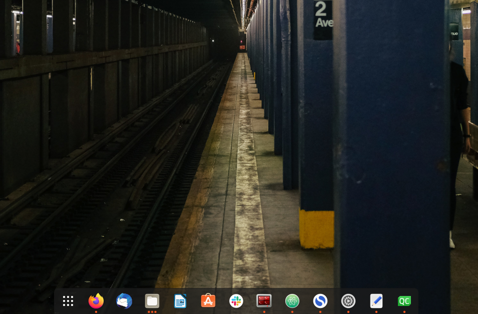

# Installation

1. [Install ROS packages](#ros)
2. [QtCreator](#qt)
3. [Atom](#atom)
4. [ChatGPT from terminal](#chat-gpt)
5. [Troubleshooting with Sharework cell](#troubleshoot)
6. [Useful stuff](#tricks)
7. [Guides and tutorials](#guides)

Installation of the JRL-CARI Workspace can be done in a single workspace or a multiple workspaces.
The second saves you times during compilation.

### Installation on a single workspace
_see [here](installation_single_workspace.md)_

### Installation on multiple (overlayed) workspaces
_see [here](installation_multiple_workspace.md)_

## Install QtCreator <a name="qt"></a>
_see [here](qt_creator_installation.md)_

## Configure QtCreator
_see [here](qtcreator.md)_

## Configure Atom <a name="atom"></a>
_see [here](atom.md)_

## ChatGPT from terminal <a name="chat-gpt"></a>
_see [here](chat-gpt.md)_

## Troubleshooting with Sharework cell <a name="troubleshoot"></a>

Cannot connect to the UR10e robot:

1) can you ping the robot (ping 192.168.10.1)?
2) if yes, can you login to the robot (ssh root@192.168.10.1  pwd:easybot)?
3) if yes, did you open the firewall ports?  sudo ufw allow 50001/tcp AND sudo ufw allow 50002/tcp

## Useful stuff <a name="tricks"></a>

### Catkin commands
* clean all the deleted packages
```
catkin clean --orphans
```
### Optimization flags
In the CMAKE File add these flags
```
add_compile_options(-std=c++14 -funroll-loops -Ofast)
set(CMAKE_BUILD_TYPE Release)
```
see [here](https://gcc.gnu.org/onlinedocs/gcc-4.5.2/gcc/Optimize-Options.html) for more info.


### Debug commands
* disable thread message in gdb:
```
nano ~/.gdbinit
set print thread-events off
```

### Colored ROS_INFO_STREAM
Copy the code from these files [.cpp](https://github.com/JRL-CARI-CNR-UNIBS/installation/blob/master/log.cpp), [.h](https://github.com/JRL-CARI-CNR-UNIBS/installation/blob/master/log.h) to define colored `ROS_INFO_STREAM`

### Git commands
_see [here](git_useful_commands.md)_

### Colcon tips
_see [here](colcon_tips.md)_

### Bash tips

ROS2 tips are [here](./bash_tips.md).

Copy these commands into your .bashrc file:
* see git branch name next to the path in the terminal. It also show the status of the branch (unstaged files, sync with remote), see [here](https://jon.sprig.gs/blog/post/1940) for details

```bash
force_color_prompt=yes
color_prompt=yes
parse_git_branch() {
 git branch 2> /dev/null | sed -e '/^[^*]/d' -e 's/* \(.*\)/(\1)/'
}
GIT_PS1_DESCRIBE_STYLE='contains'
GIT_PS1_SHOWCOLORHINTS='y'
GIT_PS1_SHOWDIRTYSTATE='y'
GIT_PS1_SHOWSTASHSTATE='y'
GIT_PS1_SHOWUNTRACKEDFILES='y'
GIT_PS1_SHOWUPSTREAM='auto'
if [ "$color_prompt" = yes ]; then
 PS1='${debian_chroot:+($debian_chroot)}\[\033[01;32m\]\u@\h\[\033[00m\]:\[\033[01;34m\]\w\[\033[01;31m\]$(__git_ps1)\[\033[00m\]\$ '
else
 PS1='${debian_chroot:+($debian_chroot)}\u@\h:\w$(parse_git_branch)\$ '
fi
unset color_prompt force_color_prompt
```

* automatic `ls` after `cd` or `roscd`

```
function cd {
    builtin cd "$@" && ls -F
    }
```

### How to write a README.md

README files are Markdown files. Take a look at [this cheatsheet](https://github.com/adam-p/markdown-here/wiki/Markdown-Here-Cheatsheet) for Markdown commands.

Modern text editors like Sublime Text and VScode allows you to preview Markdown files locally. _see [here](atom.md)_

### Ubuntu appearance

If you want your dock to look like this:




Place this in the terminal:

```
gsettings set org.gnome.shell.extensions.dash-to-dock extend-height false
gsettings set org.gnome.shell.extensions.dash-to-dock dock-position BOTTOM
gsettings set org.gnome.shell.extensions.dash-to-dock transparency-mode FIXED
gsettings set org.gnome.shell.extensions.dash-to-dock dash-max-icon-size 64
gsettings set org.gnome.shell.extensions.dash-to-dock unity-backlit-items true
gsettings set org.gnome.shell.extensions.dash-to-dock show-apps-at-top true
```
### Ubuntu bug fix
* Disable "Use hardware acceleration when available" if Google Chrome won't open and freeze your PC.

## GUIDES AND TUTORIAL <a name="guides"></a>

Modern CMake 
[guide]((https://gist.github.com/mbinna/c61dbb39bca0e4fb7d1f73b0d66a4fd1)
[example](https://github.com/schweitzer/modern-cmake-tutorial)
