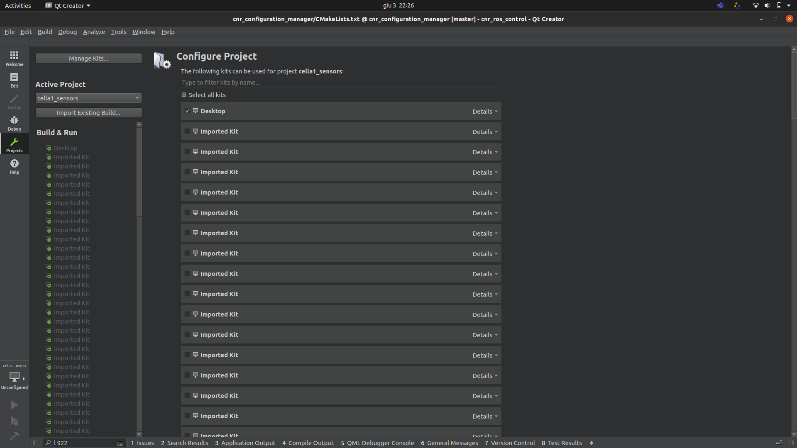
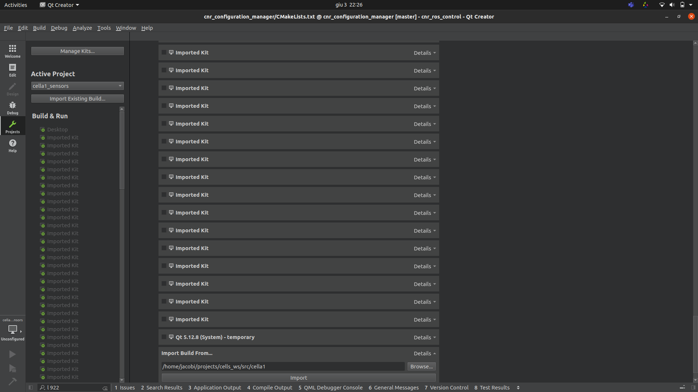
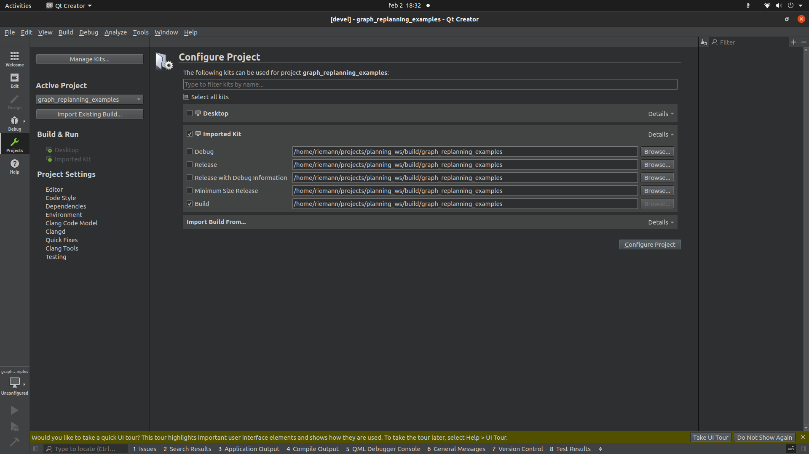
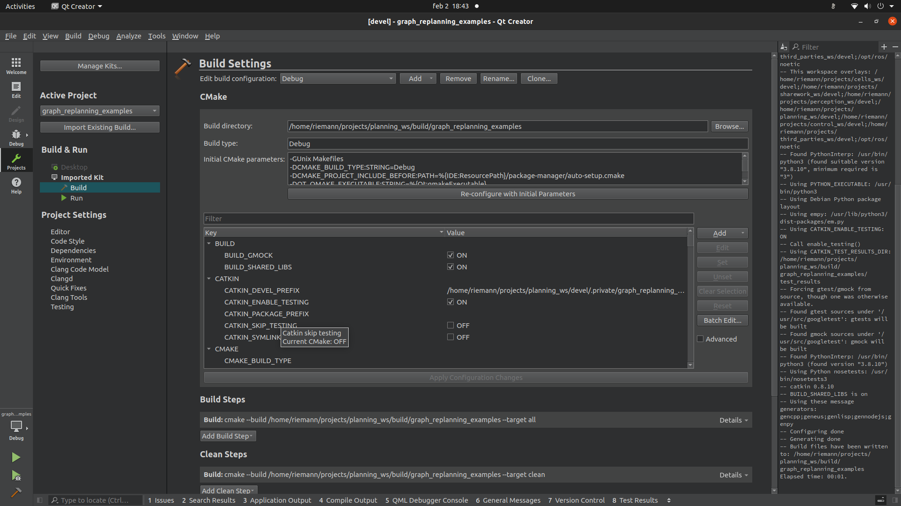

# Configure Qtcreator

Always run _qtcreator_ from terminal to source the ROS environmental variable

# Qtcreator installed using sudo apt install (Qtcreator 4)

```diff
- Bugfix: QtCreator 4 with Ubuntu 20.04
- QtCreator 4.11 running on Ubuntu 20.04 has a known bug that affects semantic highlighting.
- To fix it go to Help->About plugins and uncheck "ClangCodeModel"
```

## set tag and indent size

Please set "Tab size" and "Indent size" equal to 2 in _Tools->Options->Text Editor->Behavior_ and "Backspace indentation" to None. This helps portability of the indentation.
In _Tools->Options->C++_ import ["good_man.xml"]()

## open a package the first time
There are two methods to correctly import a package, in both cases you have to compile the package once from terminal before importing the package.

### option 1

- Click on Tools->options

- Select Build & Run

- In Default build directory, set __/home/user/projects/**[WORKSPACE]**/build/%{CurrentProject:Name}__
where **[WORKSPACE]** is the workspace name of the package you want to open.

- open the CMakeLists.txt file of the package

### option 2


- open the CMakeLists.txt file of the package

- in Configure project window, unselect "Desktop"

- in Configure project window scroll down to find "Import build from build"



- click on details


- click on browse and select the build directory or the package __/home/user/projects/**[WORKSPACE]**/build/[CurrentProjecName]__


- click on import

# Qtcreator installed using the online installer (Qtcreator 6)
First, open Qtcreator and change the default build directory:

- Click on Tools->options
- Select Build & Run
- In Default build directory, set __/home/user/projects/**[WORKSPACE]**/build/%{CurrentProject:Name}__
where **[WORKSPACE]** is the workspace name of the package you want to open.

When you want to import a package make sure you have already compiled it.
Then, open Qtcreator:

- File -> open file or project and select the CMakeLists.txt file of the package
- Select Import Existing Build and select the package in the build folder of the workspace
__/home/user/projects/**[WORKSPACE]**/build/[CurrentProjecName]__



-In Edit build configuration change to Debug or Release depending on the variable CMAKE_BUILD_TYPE set in the CMakeLists.txt file. Note: the two fields must coincide



- Now you can go to edit tab to work with your package
