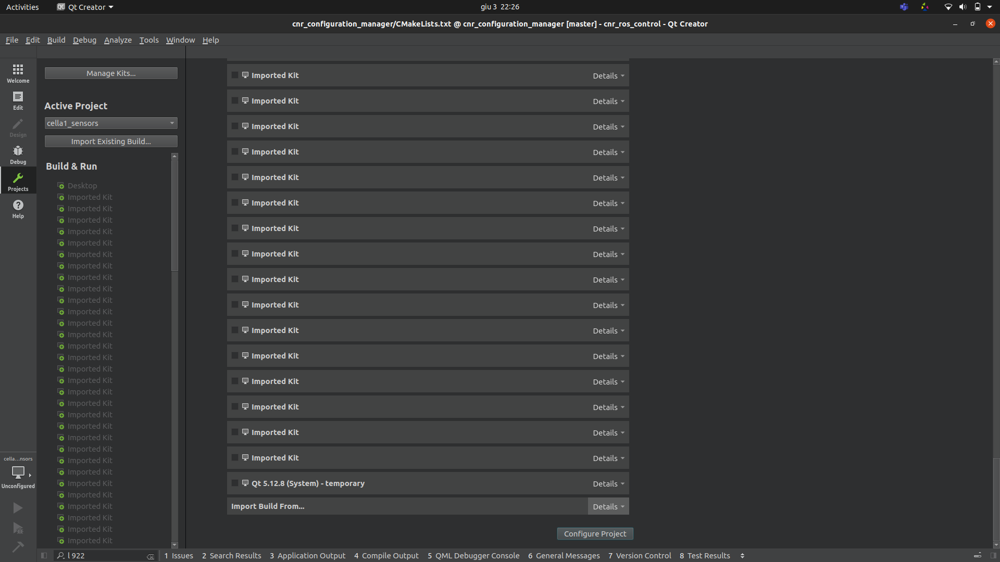

# configure qtcreator

Always run _qtcreator_ from terminal to source the ROS environmental variable

# open a package the first time
There are two methods to correctly import a package, in both cases you have to compile the package once from terminal before importing the package.

## option 1

- Click on Tools->options

- Select Build & Run

- In Default build directory, set __/home/jacobi/projects/**[WORKSPACE]**/build/%{CurrentProject:Name}__
where **[WORKSPACE]** is the workspace name of the package you want to open.

- open the CMakeLists.txt file of the package

## option 2

- open the CMakeLists.txt file of the package

- in Configure project window, unselect "Desktop"

- in Configure project window scroll down to find "Import build from build"

- click on details

- click on browse and select the build directory or the package __/home/jacobi/projects/**[WORKSPACE]**/build/[CurrentProjecName]__

- click on import
